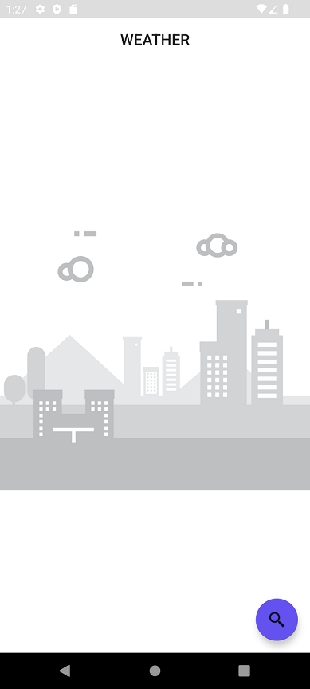
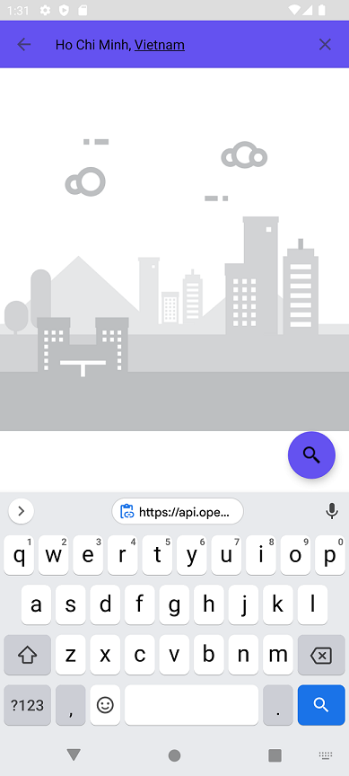
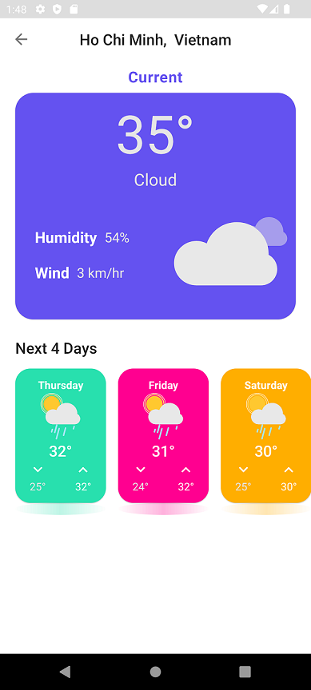
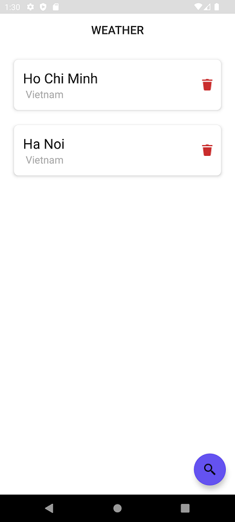

# Weather

## Architecture
This project follow **CLean Architecture**.

The project contains 3 modules:

1. Domain

    - This module contains business logic models of the application
    - This module define the Repository interfaces, then the higher modules can implement these interfaces
    - It also define Use Cases that handle business logic of the application using Repository interfaces

2. Data

    - This module contains Repository implementations
    - This module contains Android components (such as Network, Data Soures..) that can be used in Repository implementation

3. Presentation

    - This module handles UI parts of the application
    - This module follows MVVM pattern

The project use **Hilt** for Dependency Injection

## Libraries used

The application uses following external libraries:

1. **Glide**: to load image to ImageView
2. **Lottie**: to show weather animation
3. **Retrofit**: to handle HTTP requests
4. **Realm**: to handle CRUD actions

## Main functions

The application has 2 pages

1. Main page

    - This page shows the favourite cities
    - Users can remove a city (by clicking on the delete button of an item)
    - It also have a search view to let user input the city name (by clicking on the Floating button). The application accept the query like `Ha Noi` or `Ha Noi, Vietnam`
    - When user searh for a city, the application will save the city and move to the Details page

2. Details page

    - This page shows the weather data associated with the search city name
    - It shows the weather of today and next 4 days
    - The data is fetched from https://api.openweathermap.org/data/2.5/

### Screenshot

